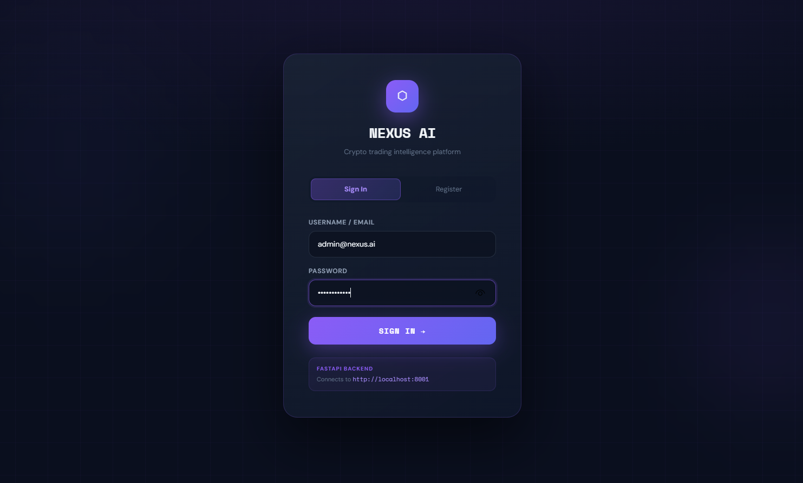
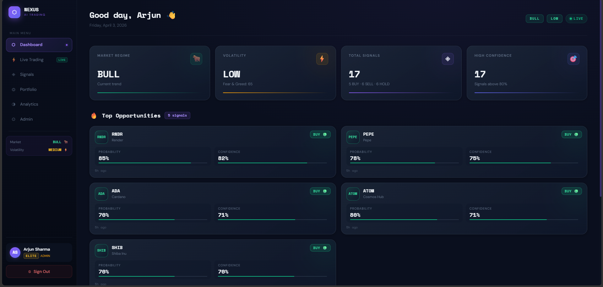
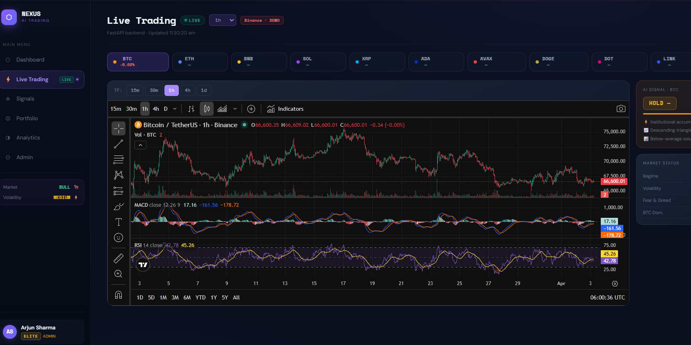
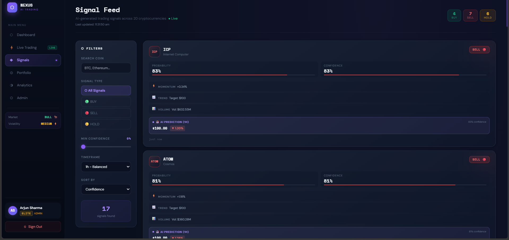

# NEXUS AI - Crypto Quant Trading Platform

[](https://python.org)
[](https://fastapi.tiangolo.com)
[](https://react.dev)
[](https://vitejs.dev)
[](LICENSE)

> **Advanced AI-Powered Cryptocurrency Trading Intelligence Platform**

NEXUS AI is a comprehensive cryptocurrency trading platform featuring real-time AI predictions, multi-timeframe analysis, automated trading bots, backtesting capabilities, and live market data visualization.

---

## Team NEXUS

| Member | Role | Email | Contribution |
|--------|------|-------|--------------|
| **Amandeep** | Lead Developer & Architect | amandeep@nexus.ai | Backend API, ML Engineer, LSTM Models, Predictions, Data Pipeline, System Design |
| **Karan Sahoo** | Strategy & Backtesting Developer | karan@nexus.ai | Strategy Development, Backtesting Engine |
| **Biswajit Das** | Frontend Developer | biswajit@nexus.ai | UI/UX, React Components, Dashboard |
| **Priyabata Pradhan** | Frontend Developer | gudu@nexus.ai | UI/UX, React Components, Dashboard, Deployment, Testing |

---

## Features

### Core Trading Features
- **Live Trading Dashboard** - Real-time candlestick charts with AI overlay predictions
- **Multi-Timeframe Predictions** - 15m, 30m, 1h, 4h, 1d price predictions using LSTM neural networks
- **AI Signal Generation** - BUY/SELL/HOLD signals with confidence scores (60-95%)
- **24/7 Market Automation** - Automated data fetching and prediction updates every 15 minutes
- **Portfolio Management** - Track positions, P&L, and portfolio performance

### Technical Analysis
- **10 Strategy Backtesting** - SMA Crossover, EMA, RSI, MACD, Bollinger Bands, Momentum, VWAP, Stochastic, ADX, ML
- **Walk-Forward Validation** - Prevent overfitting with rolling window optimization
- **Risk Management** - Position sizing, stop-loss, take-profit calculations
- **Market Regime Detection** - Bull/Bear/Neutral market classification

### AI & Machine Learning
- **LSTM Neural Networks** - Deep learning price prediction models
- **Multi-Coin LSTM** - Single model trained on 17+ cryptocurrencies
- **Ensemble Fusion** - Combine AI predictions with traditional strategies
- **Genetic Optimization** - Automated strategy weight optimization

### Live Trading
- **Paper Trading** - Test strategies without real money
- **Live Binance Integration** - Real order execution (optional)
- **Trading Bot** - Automated bot with configurable strategies
- **Real-time WebSocket** - Live price feeds and updates

---

## Tech Stack

### Frontend
- **React 18** - Modern UI library with hooks
- **Vite** - Fast development and building
- **TailwindCSS** - Utility-first styling
- **Recharts** - Interactive charts and visualizations
- **Axios** - HTTP client with interceptors
- **JWT Auth** - Secure authentication

### Backend
- **FastAPI** - High-performance Python API framework
- **SQLAlchemy** - ORM for database operations
- **SQLite** - Database for user data, predictions, trades
- **Binance API** - Live market data and trading
- **CoinGecko API** - Price feeds and market data

### AI/ML
- **TensorFlow/Keras** - LSTM neural networks
- **scikit-learn** - Random Forest, preprocessing
- **NumPy/Pandas** - Data manipulation
- **joblib** - Model serialization

---

## Quick Start

### Prerequisites
- Python 3.10+
- Node.js 18+
- Git

### Option 1: One-Click Launcher (Recommended)
```bash
python start_app.py
```

### Option 2: Manual Setup

**1. Clone and Setup Backend**
```bash
cd backend
pip install -r requirements.txt
python init_db.py  # Initialize database
uvicorn main:app --host 127.0.0.1 --port 8000 --reload
```

**2. Setup Frontend**
```bash
cd frontend
npm install
npm run dev
```

**3. Access Application**
- Frontend: http://localhost:5173/
- Backend API: http://127.0.0.1:8000
- API Documentation: http://127.0.0.1:8000/docs

---

## Login Credentials

### Admin Account
| Email | Password | Role | Plan |
|-------|----------|------|------|
| amandeep@nexus.ai | admin123 | Admin | ELITE |

### User Accounts
| Email | Password | Role | Plan |
|-------|----------|------|------|
| karan@nexus.ai | user123 | User | PRO |
| biswajit@nexus.ai | user123 | User | PRO |
| gudu@nexus.ai | user123 | User | PRO |

---

## Supported Cryptocurrencies (17 Coins)

| Symbol | Name | Symbol | Name | Symbol | Name |
|--------|------|--------|------|--------|------|
| BTC | Bitcoin | ETH | Ethereum | BNB | Binance Coin |
| SOL | Solana | XRP | Ripple | ADA | Cardano |
| AVAX | Avalanche | DOGE | Dogecoin | DOT | Polkadot |
| LINK | Chainlink | MATIC | Polygon | LTC | Litecoin |
| BCH | Bitcoin Cash | UNI | Uniswap | ATOM | Cosmos |
| XLM | Stellar | ICP | Internet Computer |

---

## Project Structure

```
CryptoQuant/
├── 📁 frontend/                    # React + Vite Frontend
│   ├── 📁 src/
│   │   ├── 📁 api/                # API integration (api.js)
│   │   ├── 📁 components/         # React components
│   │   │   ├── BacktestReal.jsx
│   │   │   ├── CoinSelector.jsx
│   │   │   ├── MultiTimeframePredictions.jsx
│   │   │   ├── SignalCard.jsx
│   │   │   └── StrategyBacktestDashboard.jsx
│   │   ├── 📁 context/            # AuthContext
│   │   ├── 📁 hooks/              # useLiveData.js
│   │   ├── 📁 pages/              # Page components
│   │   │   ├── Dashboard.jsx
│   │   │   ├── Login.jsx
│   │   │   ├── Signals.jsx
│   │   │   └── TradingDashboard.jsx
│   │   ├── 📁 services/           # API services
│   │   └── main.jsx               # Entry point
│   ├── package.json
│   └── vite.config.js
│
├── 📁 backend/                     # Python FastAPI Backend
│   ├── 📁 app/
│   │   ├── 📁 api/                # API endpoints
│   │   │   ├── admin.py
│   │   │   ├── analytics.py
│   │   │   ├── auth.py
│   │   │   ├── bot.py
│   │   │   ├── live.py
│   │   │   ├── signals.py
│   │   │   ├── strategies10.py
│   │   │   └── trading.py
│   │   ├── 📁 core/               # Security, config
│   │   ├── 📁 db/                 # Database models
│   │   └── 📁 services/            # Business logic
│   ├── 📁 ml/                     # ML models
│   │   ├── model_loader.py
│   │   └── multi_train.py
│   ├── 📁 services/               # Automation
│   │   ├── ai_fusion.py
│   │   ├── binance_service.py
│   │   ├── genetic.py
│   │   ├── market_automation.py
│   │   ├── portfolio_engine.py
│   │   └── walk_forward.py
│   ├── main.py                    # FastAPI entry point
│   ├── init_db.py                 # Database initializer
│   └── requirements.txt
│
├── 📁 models/                     # Saved ML models
├── start_app.py                   # Launcher script
└── README.md                      # This file
```

---

## API Endpoints

### Authentication
```
POST /api/auth/login              # User login
POST /api/auth/register           # User registration
```

### Signals & Predictions
```
GET  /api/signals                  # Get all trading signals
GET  /api/signals/current/{sym}    # Signal for specific coin
GET  /api/signals/batch            # Batch signals
GET  /api/predictions              # All AI predictions
GET  /api/predictions/{symbol}     # Specific coin prediction
```

### Live Trading
```
GET  /api/live/price/{symbol}      # Current price
GET  /api/live/klines/{symbol}     # Candlestick data
GET  /api/live/balance             # Account balance
GET  /api/live/account             # Account info
POST /api/live/order               # Place order
```

### Portfolio & Analytics
```
GET  /api/portfolio                # User portfolio
POST /api/portfolio                # Update portfolio
GET  /api/analytics/equity         # Equity curve
GET  /api/market/status            # Market status
```

### Admin
```
GET  /api/admin/users              # List users
PATCH /api/admin/users/{id}        # Update user plan
```

---

## Key Features Explained

### 1. Multi-Timeframe Predictions
The system generates predictions for 5 timeframes:
- **15m**: Short-term scalping signals
- **30m**: Intraday trading
- **1h**: Primary trading timeframe (default)
- **4h**: Swing trading
- **1d**: Long-term positions

### 2. 24/7 Automation Service
- Fetches live prices every 15 minutes
- Generates new predictions automatically
- Stores market data and predictions in database
- Auto-deletes data older than 1 day
- Runs background threads for continuous operation

### 3. AI Strategy Fusion
Combines multiple strategies with weighted ensemble:
```
FINAL_SIGNAL = (SMA * w1) + (RSI * w2) + (LSTM * w3) + (MACD * w4) + (BB * w5)
```
Weights adapt based on recent performance.

### 4. Walk-Forward Validation
Prevents overfitting by:
- Training on past data only
- Testing on future unseen data
- Sliding window approach
- Rolling optimization

---

## Development

### Running Tests
```bash
cd backend
pytest tests/
```

### Training Models
```bash
cd backend
python train_30coins.py  # Train all 30 coin models
python ml/multi_train.py  # Multi-timeframe training
```

### Database Management
```bash
cd backend
python init_db.py  # Initialize/reset database
```

---

## Environment Variables

Create `.env` file in backend directory:
```env
SECRET_KEY=your_secret_key_here
BINANCE_API_KEY=your_binance_api_key
BINANCE_API_SECRET=your_binance_secret
DATABASE_URL=sqlite:///./crypto_quant.db
```

---

## Screenshots

### Login Page

*Secure authentication with JWT*

### Dashboard

*Real-time market overview with AI predictions and trading signals*

### Live Trading

*Interactive charts with technical indicators and AI signal overlay*

### Signal Feed

*AI-generated BUY/SELL/HOLD signals with confidence scores*

---

## Contributing

1. Fork the repository
2. Create feature branch: `git checkout -b feature-name`
3. Commit changes: `git commit -m "Add feature"`
4. Push to branch: `git push origin feature-name`
5. Submit Pull Request

---

## License

MIT License - See [LICENSE](LICENSE) file

---

## Support

For support, email the team:
- **Amandeep**: amandeep@nexus.ai
- **Karan Sahoo**: karan@nexus.ai
- **Biswajit Das**: biswajit@nexus.ai
- **Priyabata Pradhan**: gudu@nexus.ai

---

## Acknowledgments

- Binance API for live market data
- CoinGecko for price feeds
- FastAPI team for the excellent framework
- React team for the frontend library

---

**Built with by Team NEXUS  2026**
